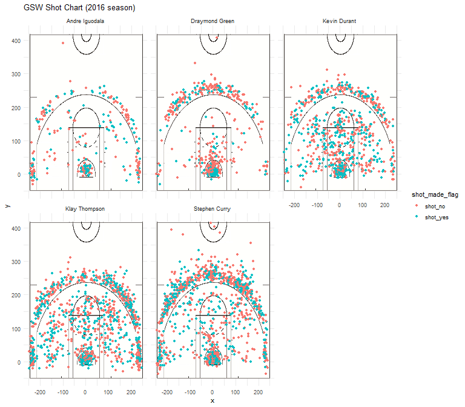

```{r message = FALSE}
library(dplyr)
```


####5.1) Effective Shooting Percentage

Use the data in shots-data.csv to create three tables to summarize Effective Shooting percentages by player
```{r}
column_types <- c("character", "character", "character", "integer", "integer", "integer", "integer", "character", "character", "character", "integer", "character", "integer", "integer", "character", "integer")
data <- read.csv(file = "../data/shots-data.csv", stringsAsFactors = FALSE, header = TRUE, colClasses = column_types)
```

#####* 2PT Effective Shooting % by Player:  
2 PT Field Goal effective shooting percentage by player, arranged in descending order by percentage.
```{r}
two_point_rank <- data %>% select(name, shot_made_flag, shot_type) %>% group_by(name) %>% summarise(total = length(shot_made_flag[shot_type == "2PT Field Goal"]), made = length(shot_made_flag[shot_type == "2PT Field Goal" & shot_made_flag == "shot_yes"]), perc_made = made / total * 100) %>% arrange(desc(perc_made))
```

#####* 3PT Effective Shooting % by Player:  
3 PT Field Goal effective shooting percentage by player, arranged in descending order by percentage.
```{r}
three_point_rank <- data %>% select(name, shot_made_flag, shot_type) %>% group_by(name) %>% summarise(total = length(shot_made_flag[shot_type == "3PT Field Goal"]), made = length(shot_made_flag[shot_type == "3PT Field Goal" & shot_made_flag == "shot_yes"]), perc_made = made / total * 100) %>% arrange(desc(perc_made))
```

#####* Effective Shooting % by Player:  
Overall (i.e. including 2PT and 3PT Field Goals) effective shooting percentage by player, arranged in descending order by percentage.
```{r}
overall_ESP_rank <- data %>% select(name, shot_made_flag) %>% group_by(name) %>% summarise(total = length(shot_made_flag), made = length(shot_made_flag[shot_made_flag == "shot_yes"]), perc_made = made / total * 100) %>% arrange(desc(perc_made))
```

---

##5.2) Narrative

Do you still remember the miraculous record of Golden State Warriors in the 2016-17 season? They won NBA Finals with 4-1 (versus Cleveland Cavaliers); they became the first team with a 16-1 record in Playoffs; they got their fifth champion in the team history, ranking the 4th in NBA history. And so on and so forth. How did they achieve such excellent record as a team? Let's take a step back and take a close look at five individual players in the GSW team: Stephen Curry, Kevin Durant, Draymond Green, Andre Iguodala, and Klay Thompson.  
To find out how these five players shape the performance of the team in the season, it is a good idea to examine their shooting data. That's what I did in this data analysis project - prepare, visualize and summarize shots data for the five players in the 2016-17 NBA season.

###Motivation and Background

Based in Oakland, California, the Golden State Warriors is a founding team of the League. Since 2015, GSW has been able to make it to the NBA Finals (with Cleveland Cavaliers) and won 2015, 2017 and 2018 Finals. This made me curious about how the team achieve these wonderful records. Therefore, I picked the 2016-17 season to analyze the shots data of five major players in the team, looking for some key insights into their secret of success.

###Data

I used one data set of shots data for each of the five major players. The data sets contain some of their shots in the 2016-17 season. Each entry includes the basic information for the game (e.g. date of the game, opponent), and details of the shot (e.g. time of the game in which the shot occured, whether the shot was made or missed, the type of shot, and the position / distance of the shot within the court, etc.). These data sets were carefully cleaned, transformed, and combined to form a grand data set used for analysis and visualization purposes that helped us draw useful information about the players' performance in the season. 

###Analysis and Discussion

```{r}

```

Take a look at this combined shots chart of five players. We will analyze the success rate of shots with respect to the shot distance and position in this section. What do you notice for each player's shot chart? Do they reflect each player's preferred shooting position?  
Note: In these charts, the court is labeled with two axes x and y so that we can refer to a position using its coordinate pair (x, y).

#####Stephen Curry as an Example
Stephen Curry, known as one of the greatest shooters in NBA history, has most shots data among five players. Here we will divide the court into three parts - left, middle, and right. The left part is where the horizontal coordinate (x value) is less than -50; the middle part is where the x value is between -50 and 50; the right part is where the x value is more than 50.
As we may have expected, the area under the basket is where most players have the highest average effective shooting percentage, including Curry. He had about three quarters of success rate when the shot distance was under 2 inches. Further away from the basket, the success rate varies by direction: the probability is significantly higher on the left than on the right of the court, whereas the middle part also sees an even higher probability. Please Look at the tables below.

```{r}
# close to basket
data %>% select(name, shot_made_flag, shot_distance) %>% filter(name == "Stephen Curry") %>% summarise(total_close = length(shot_made_flag[name == "Stephen Curry" & shot_distance < 2]), made_close = length(shot_made_flag[name == "Stephen Curry"& shot_distance < 2 & shot_made_flag == "shot_yes"]), close_perc = made_close / total_close)
```


```{r}
# left
data %>% select(name, shot_made_flag, x) %>% filter(name == "Stephen Curry") %>% summarise(total_left = length(shot_made_flag[name == "Stephen Curry" & x < -50]), made_left = length(shot_made_flag[name == "Stephen Curry" & x < -50 & shot_made_flag == "shot_yes"]), left_perc = made_left / total_left)
```

```{r}
# middle
data %>% select(name, shot_made_flag, x) %>% filter(name == "Stephen Curry") %>% summarise(total_middle = length(shot_made_flag[name == "Stephen Curry" & x < 50 & x >= -50]), made_middle = length(shot_made_flag[name == "Stephen Curry" & x < 50 & x >= -50 & shot_made_flag == "shot_yes"]), middle_perc = made_middle / total_middle)
```

```{r}
# right
data %>% select(name, shot_made_flag, x) %>% filter(name == "Stephen Curry") %>% summarise(total_right = length(shot_made_flag[name == "Stephen Curry" & x > 50]), made_right = length(shot_made_flag[name == "Stephen Curry" & x > 50 & shot_made_flag == "shot_yes"]), right_perc = made_right / total_right)
```

#####Rank Five Players' Success Rate at Different Positions
We can use similar methods to examine how distance and position affects the Effective Shooting Percentage (ESP) of each player. Here are their rankings of ESP at different shot positions:

```{r}
data %>% select(name, shot_made_flag, x) %>% group_by(name) %>% summarise(total_left = length(shot_made_flag[x < -50]), made_left = length(shot_made_flag[x < -50 & shot_made_flag == "shot_yes"]), left_perc = made_left / total_left) %>% arrange(desc(left_perc))
```

```{r}
data %>% select(name, shot_made_flag, x) %>% group_by(name) %>% summarise(total_middle = length(shot_made_flag[x >= -50 & x < 50]), made_middle = length(shot_made_flag[x >= -50 & x < 50 & shot_made_flag == "shot_yes"]), middle_perc = made_middle / total_middle) %>% arrange(desc(middle_perc))
```

```{r}
data %>% select(name, shot_made_flag, x) %>% group_by(name) %>% summarise(total_right = length(shot_made_flag[x >= 50]), made_right = length(shot_made_flag[x >= 50 & shot_made_flag == "shot_yes"]), right_perc = made_right / total_right) %>% arrange(desc(right_perc))
```

It is anticipated that all players have significantly higher ESF when shooting in the middle part of the court (49.9% to 68.9%), facing direct to the basket. Players have 32.5% to 48.5% ESF on the left side and 25.0% to 43.4% ESF on the right. The specific rankings vary among five players, but the overall trend remains the same for all.

#####Rank players' ESP by Shot Types

In our data sets, we have data for two types of shots - 2-point field goals and 3-point field goals. So we can classify all shots into these two types and analyze each player's ESF for each shot type (and the overall ESP, of course).

```{r}
two_point_rank
```

For 2-point field goals, players' ESP ranges from 49.4% to 63.8%. Though Durant and Thompson had the most attempts in our data, they are not the most accurate shooter for 2-point goals. Instead, Iguodala has a great 63.8% ESP even if he attempted fewer shots than his teammates in that season.

```{r}
three_point_rank
```
Players' ESP for 3-point goals are much lower than their respective 2-point goals, varying from 31.9% to 42.4% Klay Thompson, who ranked 4th for 2-point goals, got the top position for 3-point goals. On the contrary, performing the best for 2-point goals does not guarantee a high rank for 3-point goals.  

```{r}
overall_ESP_rank
```
As a summary for the overall shooting accurary ranking, we weighted two shot types to find the average ESP. So the overall ESP clearly centers around 50%, ranging from 42.4% to 54.1%. However, it is not true that players' with most attempts would have the highest ESP. But among all players, Draymond Green had the lowest ESP for both types of shots, making him 21.6% lower in ESP score than the top ranking player Kevin Durant. The other three players have similar overall ESP scores in the 2016-17 season. Does this ranking coincide with your impression?

###Conclusion

With the Effective Shooting Percentage rankings in mind, we can see that the all five players made great shots in the season. However, shooting at different distances, positions for different shot types does change the probability of success significantly. It is easy to understand that the farther away from the basket, the harder to make the goal. However, even at similar distances, the position of the shot would greatly change the result. It would be worth another data analysis project, for example, to examine why shooting on the right side of the court would have lower ESP than shooting on the left. In addition, it would be interesting to analyze how players' ESP change across four periods of the game. Anyway, ESP is only one metric when we analyze players' performance. It is even more important to consider the role of the players in the team, as well as how they cooperate to achieve the excellent records in that season, which will provide an even more reliable and meaningful guidance for better performance in future seasons. After all, basketball is a teamwork, and Golden State Warriors is a great team.

###References

I drew my inspiration when writing this report from the following articles:

* https://shottracker.com/articles/are-the-warriors-making-the-mid-range-relevant-again
* https://blogs.sas.com/content/iml/2016/03/21/statistical-analysis-stephen-curry-shooting.html
* http://www.nba.com/article/2017/12/14/one-team-one-stat-warriors-shooting-better-ever
* https://bleacherreport.com/articles/2749739-5-wild-stats-defining-golden-state-warriors-season#slide0

---